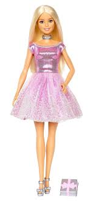
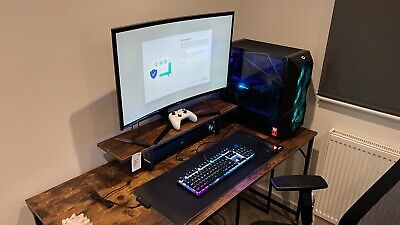

# GPT-Vision-1

We all like Moondream the 1 billion Parameters Vision Language model that kicks ass.

Well how about something smaller a 200 Million Parameter Vision Language model which is not as good as I would like it to be 

```python
from transformers import AutoModelForCausalLM
from PIL import Image

model = AutoModelForCausalLM.from_pretrained("damerajee/GPT-Vision", trust_remote_code=True)

image_path = "Your_image_path"
image = Image.open(image_path)
image = image.convert('RGB')

question = "Render a clear and concise summary of the photo."
answer = model.generate(image=image,question=question,max_new_tokens=40)
print("Answer:", answer)
```

| Image | Question | Response |
|-------|----------|----------|
|  | what color is the doll dress? | A girl doll with a pink dress |
|  | Write a terse but informative summary of the picture. | A computer keyboard with a keyboard  on it, on a wooden table with a laptop and a keyboard tray in the middle |


# Model architecture 

This Model follows the same architecture as LLava 

| Model | HF-LINK | 
-------|----------|
| GPT-VISION-1(This model is the pre-trained model )|[GPT-Vision-1](https://huggingface.co/damerajee/GPT-Vision) |
| GPT-VISION-1-FT(This model is the finetuned-one)| [GPT-Vision-1-ft](https://huggingface.co/damerajee/GPTVision-1-ft) |

# Training Details 

- We first pre-train the model while freezing the LLM and the Vision Transformers and only pre-training the projector which is a simple MLP nothing unqiue 
- Then save the pre-train model to huggingface 
- Load the pre-train model for fine-tuning but this time we froze only the Vision Transformers  
- `Also the entire process of this training was done on FREE GPUs specifically the kaggles P100 and 2 T4 GPUs`


